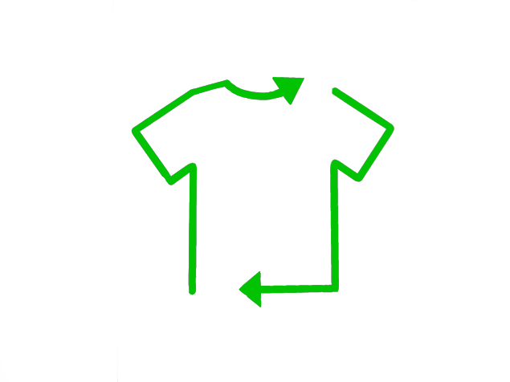
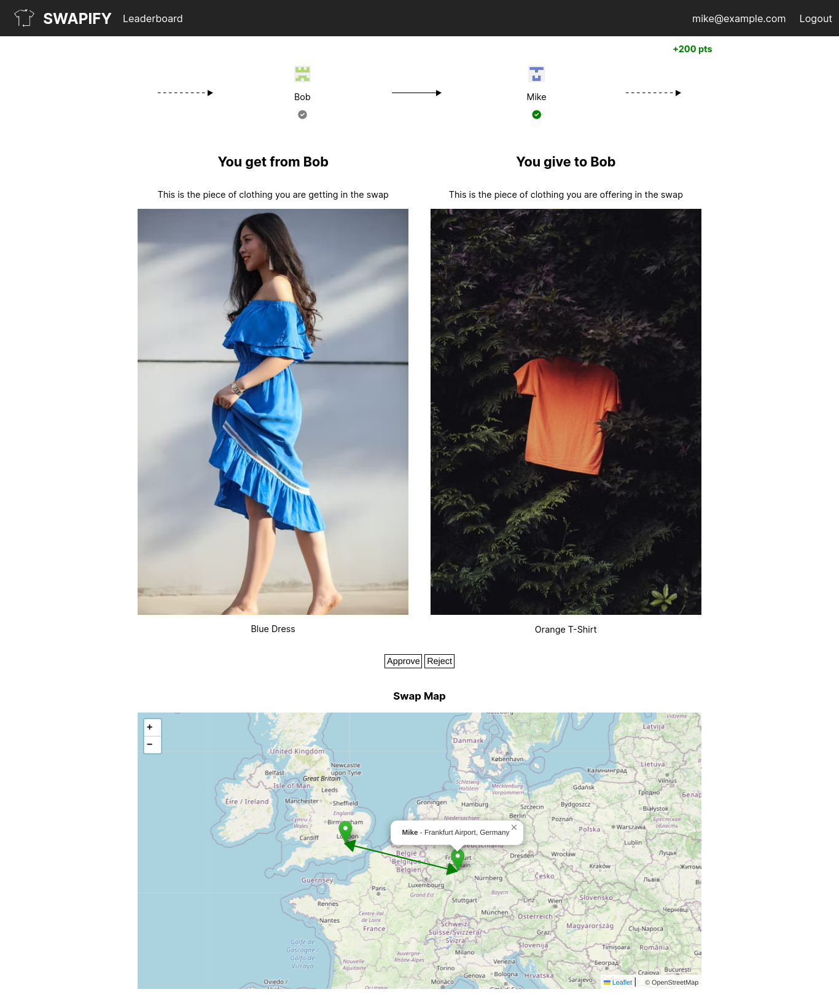

#  Swapify
Swapify lets you swap clothes that you don't want anymore to save money 💰 and help the planet 🌎:

1. Add the items you're looking for and the items you can offer to your profile, then simply sit back and wait for a cycle to be found.
2. Once a cycle is found, each user in sequence sends their clothes to the next person, and receives clothes from the previous person.
4. Users collect points and climb the leaderboard based on how many air miles and how much water their clothing swaps are saving.
3. Everyone can feel great in their new clothes and even greater about making an ethical choice!
 

### Techy stuff
Swapify is built with Python and Flask, using Jinja templates to fill the frontend with data from the CockroachDB backend. The CockroachDB is a cloud-based PostgreSQL database with 7 tables of which we use 5: User,User_Has,User_Wants,Match_Article and Article. These document all of the data we need to process the users' clothing needs. We run a Graph Theory algorithm (cycle check) to obtain n-way swaps in which any number of users pass their clothes round in a big cycle. The other 2 tables in the DB are used for Tags, an interface which we haven't quite yet finished implementing, and which would be rolled out in the next version.    
